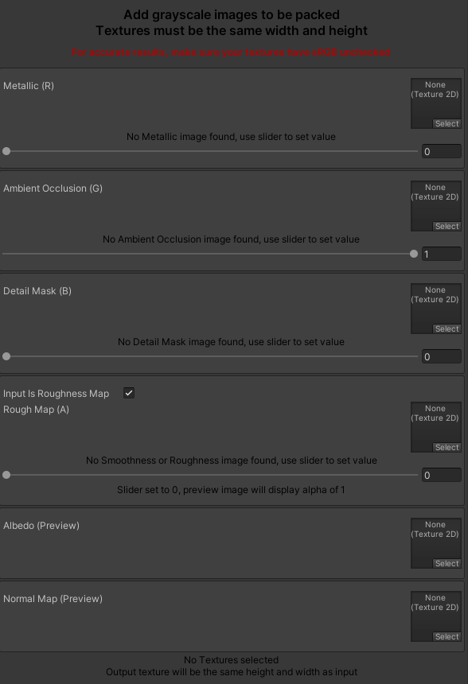

# Unity HDRP Mask Map Packer

I made a little editor extension to pack 
**Metallic, AO, Detail, and Roughness/Smoothness** maps into one image for the HDRP Lit Shader. 
Put the script anywhere in your project. To open the window, just go to the top of Unity click **Tools>Mask Map Packer**.

### Features:
* Packs grayscale textures into the appropriate channels for the HDRP Lit Shader.
* Sliders for channels that do not have textures selected.
* Preview Image.
* Checkbox if the input Roughness map (will invert colors since Lit Shader uses Smoothness Map).
* Packs grayscale textures into the appropriate channels for the HDRP Lit Shader.

### Limitations:
* Texture import settings must have sRGB unchecked (as I am not 100% sure how to convert sRGB to Linear via script).
* All texture Inputs must be the same dimensions.
* While it should support any size texture, it gets much slower with 2048x2048 and larger images 1024x1024 and below is very quick (~3 seconds).
